# wiresharka 🛜🦈
wiresharka : Analyze Network Traffic Packet # Wireshark # Security Analyst

## Objective

- Identify source and destination IP addresses involved in web browsing session
- Examine protocols used when user makes connection to website
- analyze data packets to identify the type of information sent & received by the systems that connect to each other when the network data is captured

# Analyze  Network Traffic Packet with Wireshark 

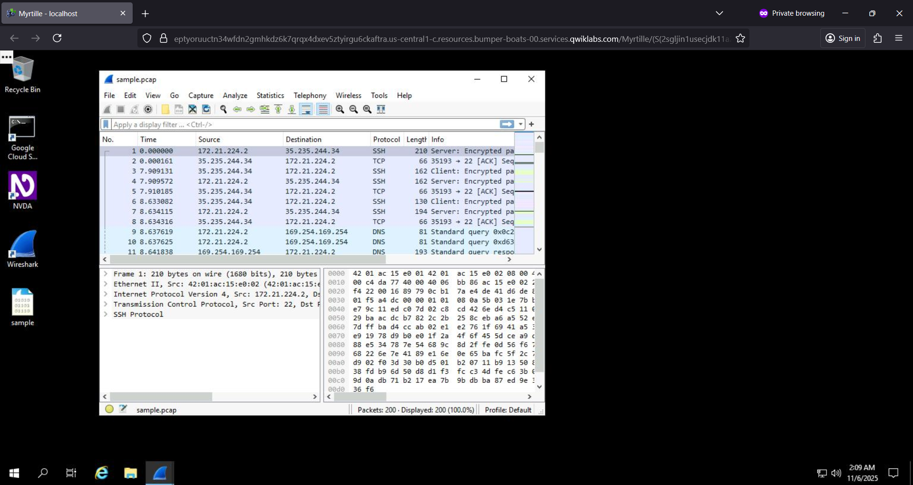

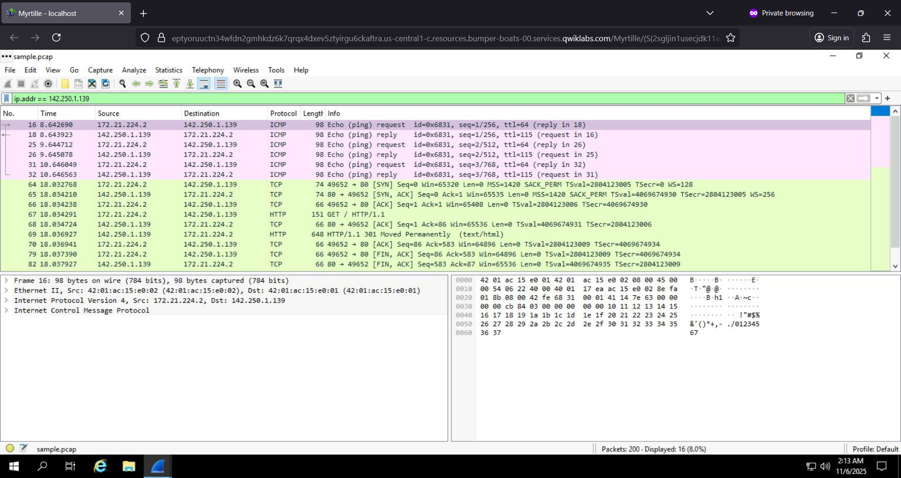

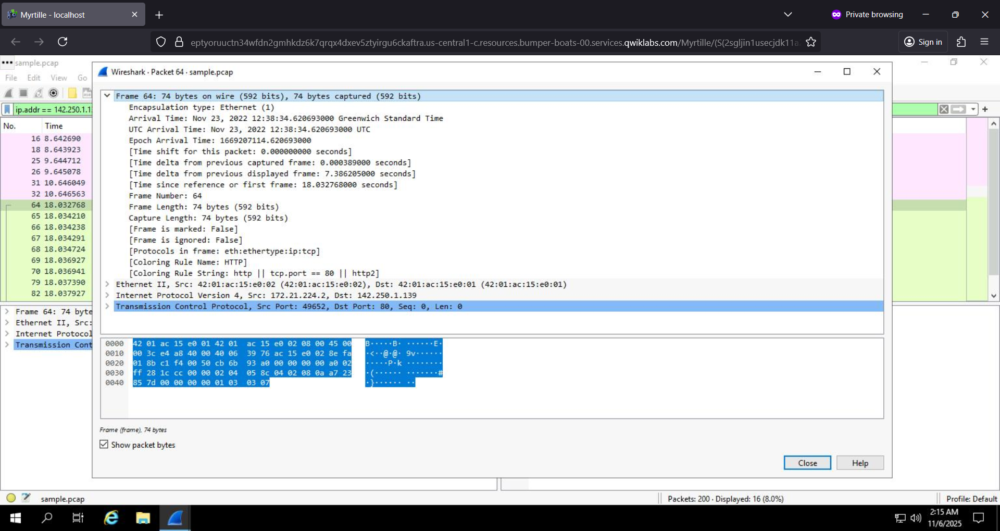

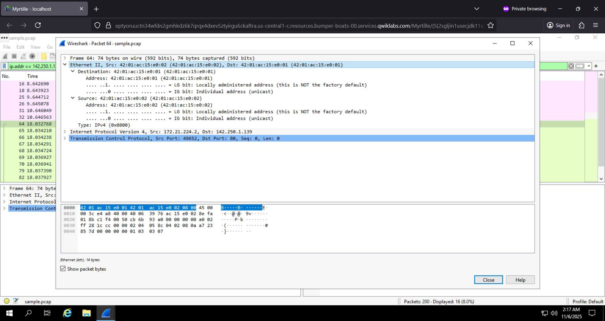

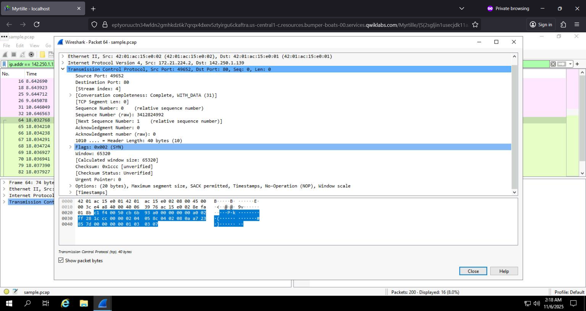

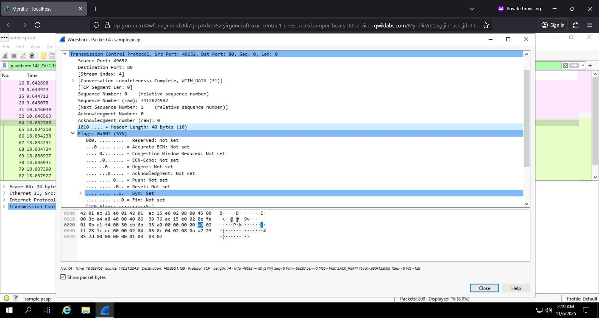

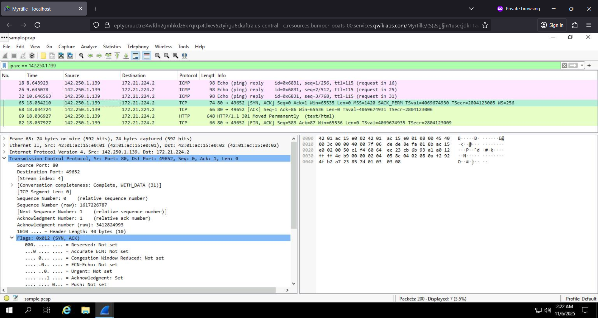

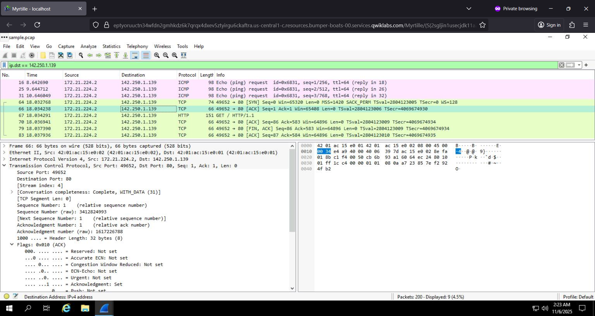

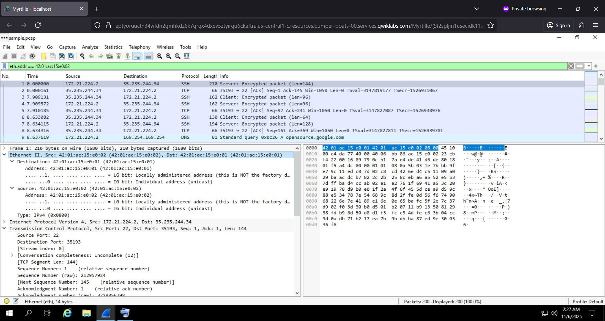

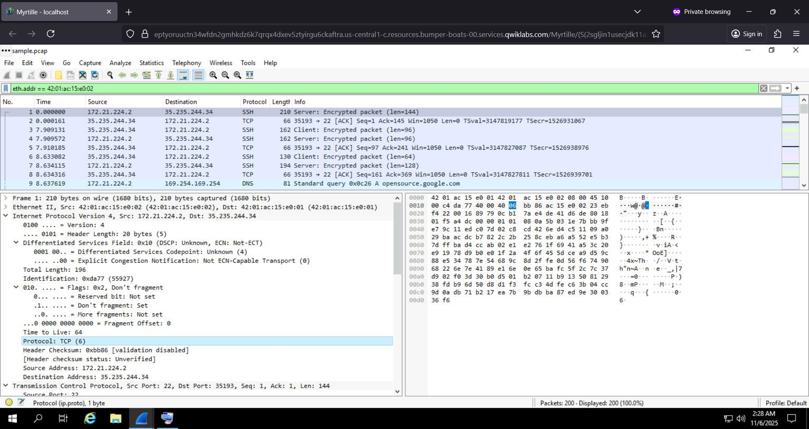

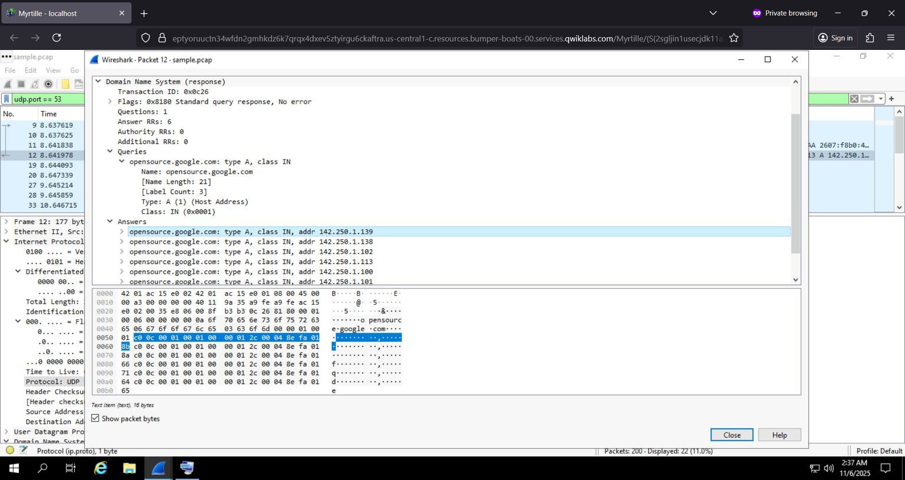

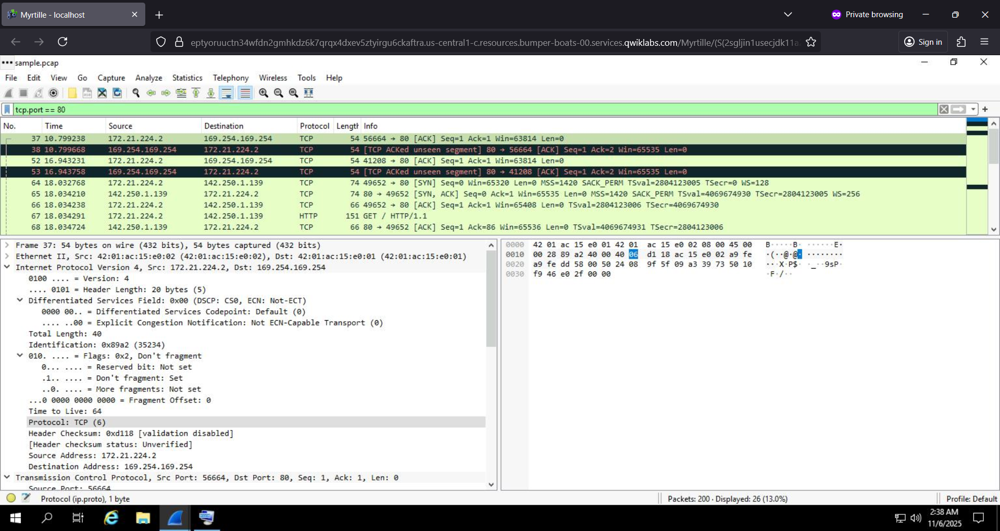

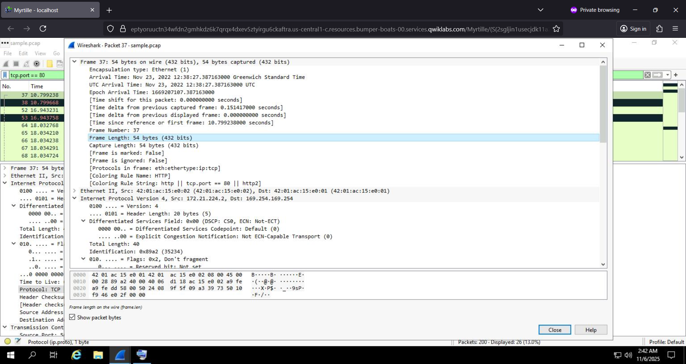

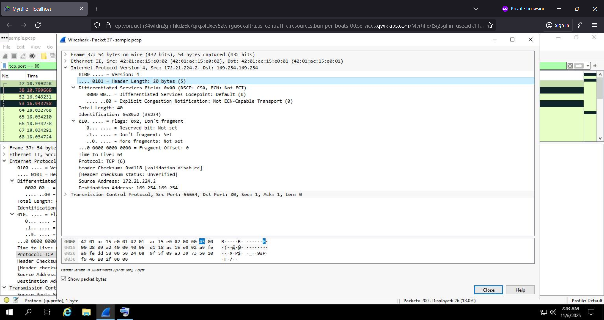

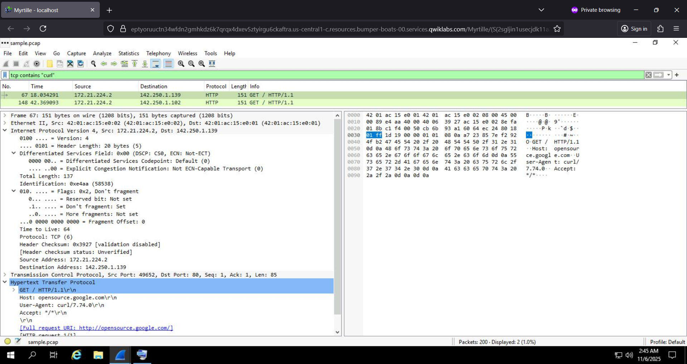

